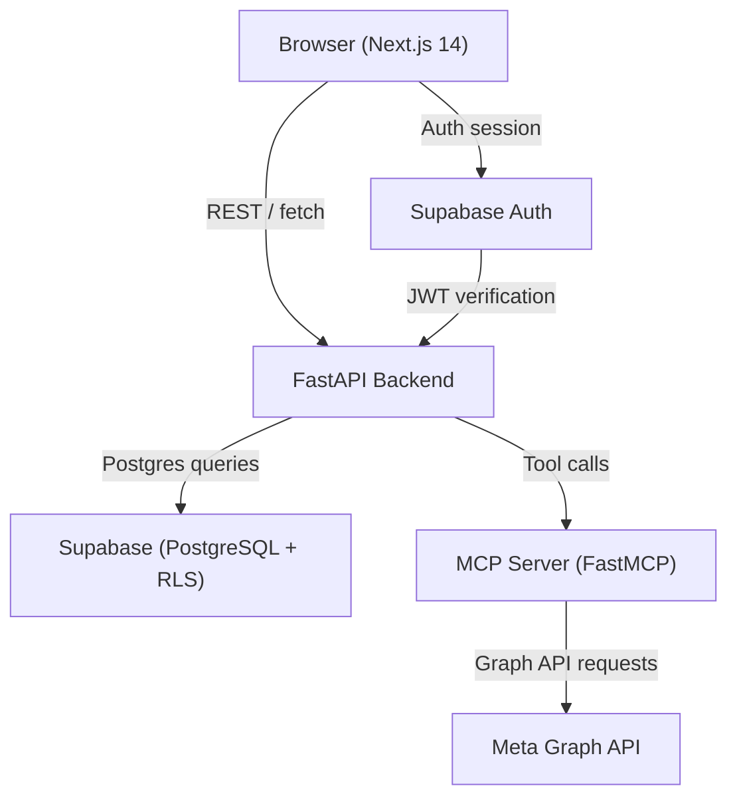
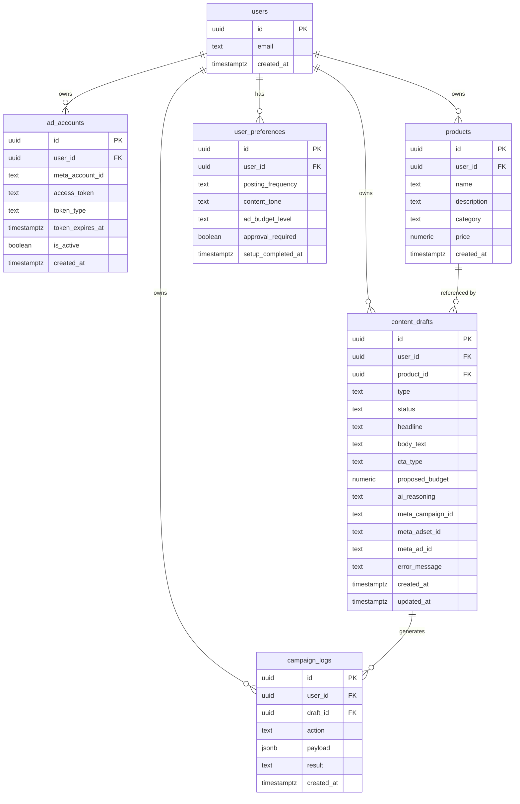
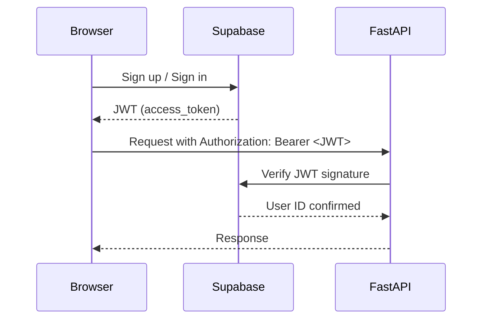
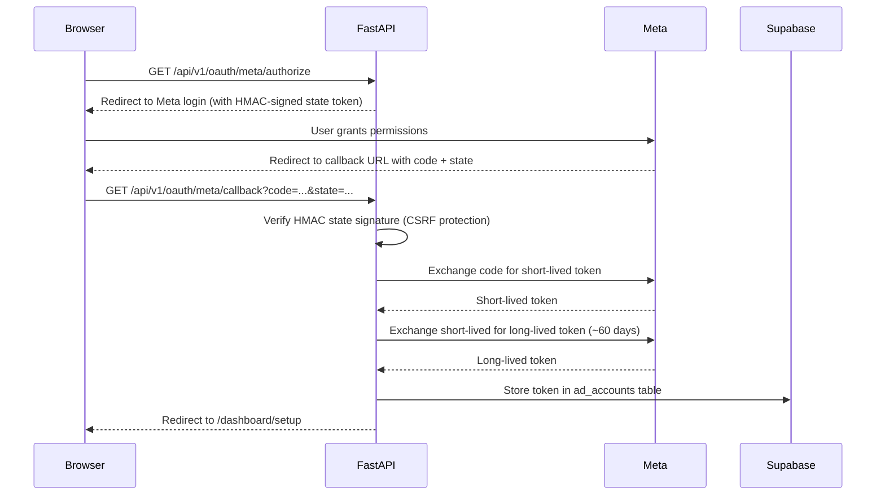
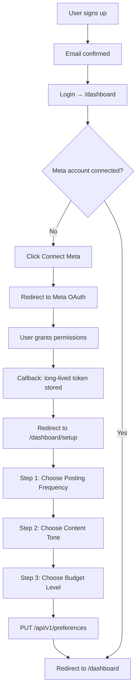
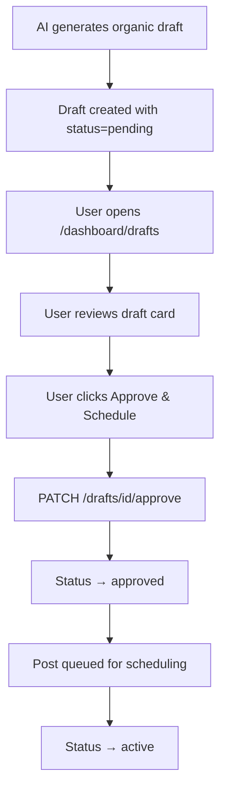
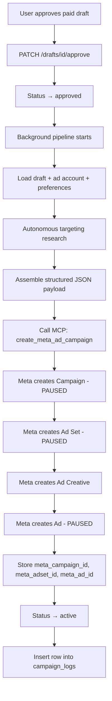
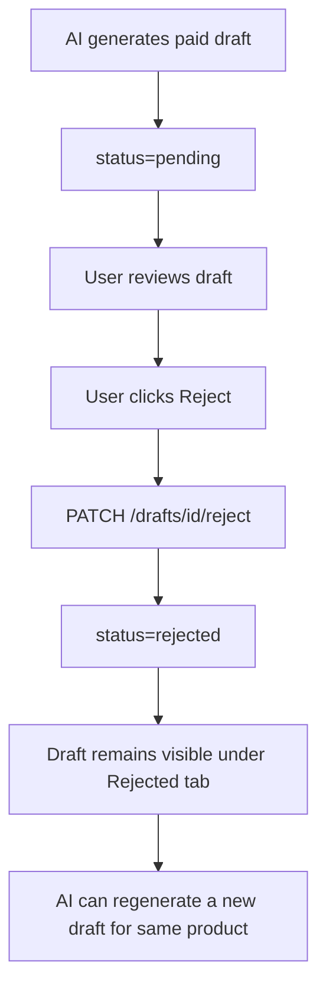
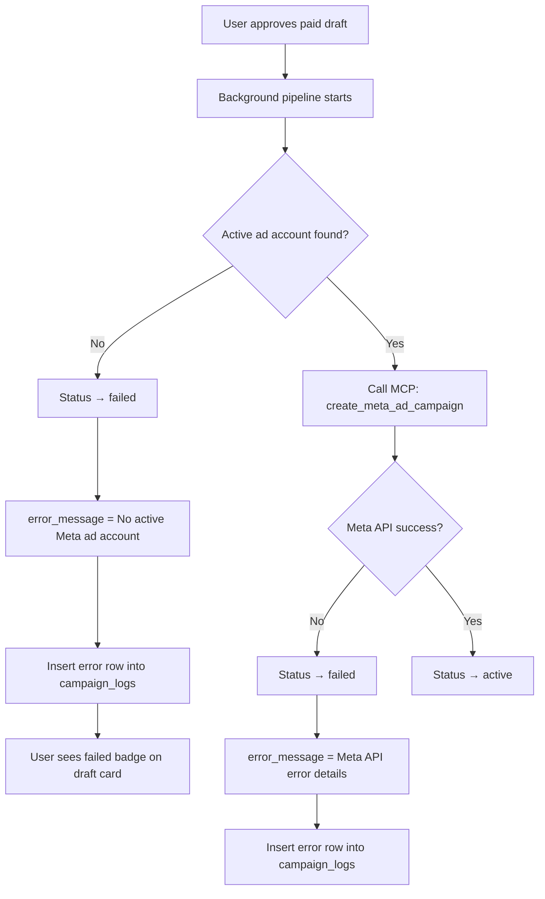
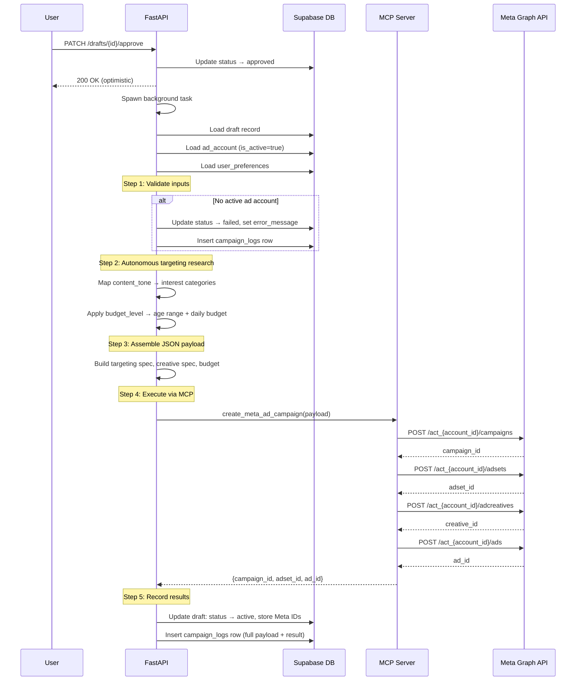

# Meta Ads AI SaaS — System Overview

## Table of Contents

1. [Architecture Overview](#architecture-overview)
2. [Technology Stack](#technology-stack)
3. [Database Schema](#database-schema)
4. [Authentication & Security](#authentication--security)
5. [API Routes Reference](#api-routes-reference)
6. [MCP Server & Tools](#mcp-server--tools)
7. [Feature Phases](#feature-phases)
8. [User Flows & Scenarios](#user-flows--scenarios)
9. [Agentic Pipeline Deep Dive](#agentic-pipeline-deep-dive)
10. [Targeting Logic](#targeting-logic)

---

## Architecture Overview

The system is a Meta Marketing Automation SaaS that allows users to connect their Meta ad accounts, configure a content strategy, and have AI-generated ad content autonomously researched, assembled, and submitted to Meta's Graph API — all with a human-in-the-loop approval step.



The frontend and backend are fully decoupled. The backend never serves HTML; it is a pure JSON API. The MCP server is an internal Python service that acts as a typed, auditable wrapper around the Meta Graph API.

---

## Technology Stack

| Layer | Technology | Port |
|---|---|---|
| Frontend | Next.js 14 (App Router) | 54561 |
| Backend | FastAPI (Python) | 54562 |
| Database | Supabase (PostgreSQL) | 54321 |
| MCP Server | Python FastMCP | internal |
| Auth | Supabase Auth (JWT) | via Supabase |
| External API | Meta Graph API | — |

---

## Database Schema

All tables enforce Row Level Security (RLS). Users can only read and write their own rows. Service-role operations (e.g., from the FastAPI backend) bypass RLS using the service key.



### Table Notes

**`ad_accounts`**
Stores the long-lived Meta OAuth token (~60 days). The `is_active` flag is used to determine which account to use when executing paid campaigns. Only one account per user is expected to be active at a time.

**`content_drafts`**
Central table for the approval workflow. The `type` column is either `organic` or `paid`. The `status` column follows this lifecycle:

```
pending → approved → publishing → active
              ↓
           rejected
              ↓
            failed
```

- `pending`: AI has generated the draft, awaiting user review.
- `approved`: User has clicked "Approve & Schedule". For paid drafts, the agentic pipeline is triggered.
- `publishing`: The backend is in the process of calling Meta's API.
- `active`: Meta has accepted the campaign/post. For paid ads, Meta entity IDs are stored.
- `rejected`: User manually rejected the draft.
- `failed`: The agentic pipeline encountered an error (e.g., no active ad account, Meta API error).

**`campaign_logs`**
Immutable audit trail. Rows are only inserted, never updated or deleted. Every significant action (approval, MCP tool call, failure) produces a log entry with a full JSON payload for debugging and compliance.

**`user_preferences`**
Set once via the Strategy Setup Wizard. The `setup_completed_at` timestamp is used to gate whether the wizard is shown again.

---

## Authentication & Security

### Platform Authentication (Supabase Auth)

Users authenticate with Supabase Auth (email/password or OAuth providers). Supabase issues a JWT that is sent with every API request. FastAPI verifies this JWT on all protected routes using the Supabase JWT secret.



### Meta OAuth 2.0 Flow



**CSRF Protection**: The `state` parameter is an HMAC-signed token containing the user's ID and a timestamp. FastAPI verifies the signature before processing the callback. This prevents an attacker from crafting a malicious callback URL.

**Token Lifecycle**: Long-lived tokens last approximately 60 days. The `token_expires_at` field allows the backend to detect expiry and prompt re-authorization.

---

## API Routes Reference

All routes are prefixed with `/api/v1`. All routes (except the OAuth authorize redirect) require a valid Supabase JWT.

### OAuth Routes

| Method | Path | Description |
|---|---|---|
| GET | `/oauth/meta/authorize` | Generates HMAC state token and redirects user to Meta login |
| GET | `/oauth/meta/callback` | Handles Meta redirect; exchanges code for long-lived token; stores in `ad_accounts` |
| GET | `/oauth/meta/accounts` | Returns all connected Meta ad accounts for the authenticated user |
| DELETE | `/oauth/meta/accounts` | Disconnects (deactivates) the user's Meta ad account |

### Preferences Routes

| Method | Path | Description |
|---|---|---|
| GET | `/preferences` | Returns the authenticated user's preferences row |
| PUT | `/preferences` | Creates or updates preferences; sets `setup_completed_at` on first save |

### Drafts Routes

| Method | Path | Description |
|---|---|---|
| GET | `/drafts` | Lists all drafts for the user, supports `?status=` filter |
| POST | `/drafts` | Creates a new AI-generated draft (called by AI generation system) |
| PATCH | `/drafts/{id}/approve` | Approves a draft; triggers agentic pipeline for paid drafts |
| PATCH | `/drafts/{id}/reject` | Rejects a draft; sets status to `rejected` |

### Products Routes

| Method | Path | Description |
|---|---|---|
| GET | `/products` | Lists all products for the user |
| POST | `/products` | Creates a new product |
| GET | `/products/{id}` | Returns a single product |
| PUT | `/products/{id}` | Updates a product |
| DELETE | `/products/{id}` | Deletes a product |

### Campaign Routes

| Method | Path | Description |
|---|---|---|
| GET | `/campaigns/insights` | Returns Meta campaign insights for the user's active ad account |
| POST | `/campaigns/pause` | Pauses a campaign via MCP |

---

## MCP Server & Tools

The MCP (Model Context Protocol) server is a Python FastMCP service that wraps the Meta Graph API. It exposes 22 typed tools. The FastAPI backend calls these tools during the agentic pipeline and for campaign management operations.

### Tool Categories

**Account Discovery**
- `get_user_ad_accounts` — Lists all ad accounts accessible by a given access token.
- `get_account_overview` — Returns account-level metrics: spend, impressions, status.

**Campaign Analysis**
- `list_campaigns` — Lists campaigns for an ad account with status filter.
- `get_campaign_insights` — Returns detailed performance metrics for a campaign (ROAS, CPC, CPM, reach).
- `list_ads` — Lists individual ads within a campaign or ad set.

**Entity Management**
- `pause_entity` — Pauses a campaign, ad set, or ad by ID.
- `enable_entity` — Re-enables a paused entity.
- `update_daily_budget` — Updates the daily budget on an ad set or campaign.

**Automated Rules**
- `create_kill_rule` — Creates a Meta automated rule that pauses an ad set when CPA exceeds a threshold.
- `create_scale_rule` — Creates a Meta automated rule that increases budget when ROAS exceeds a threshold.

**Full Funnel Creation**
- `create_meta_ad_campaign` — Creates a complete campaign hierarchy in a single call:
  1. Campaign (with objective, status=PAUSED, spend cap)
  2. Ad Set (with targeting spec, budget, schedule, optimization goal)
  3. Ad Creative (with headline, body, image hash or URL, CTA)
  4. Ad (links creative to ad set, status=PAUSED)

All entities are created in `PAUSED` status. The system never activates ads without explicit user action or an automated rule trigger.

---

## Feature Phases

### Phase 1 — Database Schema

Established the full Supabase schema with all six tables, RLS policies, and indexes. This phase defined the data contracts that all subsequent phases depend on.

### Phase 2 — Strategy Setup Wizard

After connecting a Meta account, new users are redirected to `/dashboard/setup`. The wizard collects three preferences in a card-based UI (no dropdowns):

**Step 1 — Posting Frequency**
- Daily
- 3x per week
- Weekly
- Bi-weekly

**Step 2 — Content Tone**
- Professional
- Humorous
- Educational
- Promotional

**Step 3 — Ad Budget Level**
- Conservative
- Moderate
- Aggressive

On completion, the frontend calls `PUT /api/v1/preferences` which sets `setup_completed_at`. The wizard checks for this timestamp on load and skips display if already completed.

### Phase 3 — Drafts & Approvals Dashboard

The `/dashboard/drafts` page is the primary user-facing interface. It displays AI-generated content drafts with the following information per card:

- **Type badge**: `Organic` or `Paid`
- **Status badge**: Current lifecycle status with color coding
- **Headline**: The ad or post headline
- **Body text**: Full copy
- **Image placeholder**: Visual slot for creative asset
- **Proposed budget**: For paid drafts only
- **CTA type**: e.g., Learn More, Shop Now, Sign Up
- **AI reasoning**: Explanation of why the AI generated this content

**Filter tabs**: All / Pending / Approved / Active / Rejected

**Actions on pending drafts**:
- "Approve & Schedule" — triggers approval flow
- "Reject" — moves to rejected state

UI updates are optimistic: the status badge changes immediately on click without waiting for the server response. If the server returns an error, the UI reverts.

### Phase 4 — Agentic Research & MCP Execution

When a paid draft is approved, a background pipeline runs autonomously. See [Agentic Pipeline Deep Dive](#agentic-pipeline-deep-dive) for full details.

---

## User Flows & Scenarios

### Scenario 1: New User Onboarding



### Scenario 2: Organic Post Approval



Organic drafts do not trigger the agentic pipeline. They are queued for social posting only.

### Scenario 3: Paid Ad Full Pipeline

This is the most complex flow. A paid draft goes from user approval all the way to a live (paused) Meta campaign.



**Example**: User has `content_tone=educational`, `ad_budget_level=moderate`, `proposed_budget=$30`.

Targeting research maps this to:
- Interests: Education, Online courses, E-learning
- Age range: 18–65 (moderate budget uses broad targeting)
- Daily budget: $30

The MCP call creates a complete campaign hierarchy on Meta with all entities in PAUSED status. The user can then review and manually activate via the Meta Ads Manager or a future dashboard feature.

### Scenario 4: Paid Ad Rejection



Rejected drafts are never deleted. They remain in the audit trail and are visible under the Rejected filter tab.

### Scenario 5: Paid Ad Failure



All failures are non-destructive. The draft remains in the database with a `failed` status and a human-readable `error_message`. The `campaign_logs` table contains the full JSON payload of the failed request for debugging.

### Scenario 6: Budget Level Impact

The `ad_budget_level` preference influences both the daily spend and the demographic targeting breadth.

| Budget Level | Daily Budget | Age Range | Strategy |
|---|---|---|---|
| Conservative | $10 / day | 18–65 (broad) | Wide reach, low spend, discovery phase |
| Moderate | $30 / day | 18–65 | Balanced reach and targeting |
| Aggressive | $50 / day | 25–54 (narrowed) | Higher spend on most likely converting demographic |

Aggressive budget narrows the age range because higher spend is more efficient when targeted at the core converting audience rather than spread broadly.

### Scenario 7: Tone-Based Interest Targeting

The `content_tone` preference drives interest category selection in the targeting research step.

| Content Tone | Meta Interest Categories |
|---|---|
| Professional | Entrepreneurship, Business, Marketing, Leadership |
| Humorous | Entertainment, Comedy, Social media, Memes |
| Educational | Education, Online courses, E-learning, Self-improvement |
| Promotional | Online shopping, Coupons, Deals, Retail |

These mappings are applied during the autonomous targeting research step (Step 2 of the agentic pipeline) and are included in the Ad Set targeting spec sent to the MCP server.

---

## Agentic Pipeline Deep Dive

The agentic pipeline is the core autonomous capability of the system. It runs as a background task triggered by a paid draft approval.



### Payload Structure

The assembled payload passed to `create_meta_ad_campaign` includes:

```json
{
  "ad_account_id": "act_123456789",
  "access_token": "<long-lived token>",
  "campaign": {
    "name": "AI Campaign — <headline>",
    "objective": "OUTCOME_TRAFFIC",
    "status": "PAUSED",
    "special_ad_categories": []
  },
  "adset": {
    "name": "AI AdSet — <tone> targeting",
    "daily_budget": 3000,
    "billing_event": "IMPRESSIONS",
    "optimization_goal": "LINK_CLICKS",
    "targeting": {
      "age_min": 18,
      "age_max": 65,
      "interests": [
        {"id": "...", "name": "Education"},
        {"id": "...", "name": "Online courses"}
      ],
      "geo_locations": {
        "countries": ["US"]
      }
    },
    "status": "PAUSED"
  },
  "creative": {
    "name": "AI Creative — <draft_id>",
    "headline": "<draft headline>",
    "body": "<draft body text>",
    "call_to_action_type": "<cta_type>",
    "link": "<product link>"
  }
}
```

Budget values are passed in cents (Meta API requirement): $30/day = `3000`.

### Failure Handling

The pipeline uses structured error handling at each step:

1. **Pre-flight validation**: Checks for active ad account before any external calls.
2. **MCP call failure**: Any exception from the MCP server is caught, the draft is set to `failed`, and the error message is stored.
3. **Partial failure**: If Meta creates a campaign but the ad set creation fails, the pipeline attempts cleanup and records the partial state in `campaign_logs`.
4. **All failures are logged**: Every failure path inserts a `campaign_logs` row with the full context for debugging.

---

*Generated 2026-03-02*
